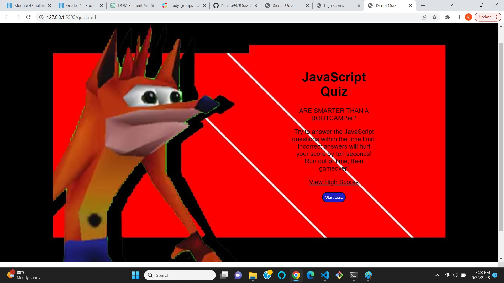

# 04 JavaScript Quiz!

## Tasks

This week we were tasked to create a functional coding quiz using javascript, html and css with only a couple days to finish the project. 🙃 The assignment was quite difficult for me but I had fun taking a creative approach and making a quiz that I will be glad to show my friends. I can read code fairly confidently but the hard part was figuring out what to plug in where; overall the project was difficult but rewarding. Started out with the html and css files but couldn't figure out how to start the javascript, but after lots of w3, youtube and reviewing previous lessons, I figured out how to proceed in javascript and learned that I need another html and javascript file for the scores. After hours of messing around with javascript, I present my end product. Hope you get that top score! 😎

## Grading Requirements

### 0%

> - A repository that has no code
>
> - A repository that includes a unique name but nothing else
>
> - A repository that includes only a README file but nothing else
>
> - A repository that only includes starter code

This Challenge is graded based on the following criteria:

### Technical Acceptance Criteria: 40%

- Satisfies all of the preceding acceptance criteria.

### Deployment: 32%

- Application deployed at live URL.

- Application loads with no errors.

- Application GitHub URL submitted.

- GitHub repository contains application code.

### Application Quality: 15%

- Application user experience is intuitive and easy to navigate.

- Application user interface style is clean and polished.

- Application resembles the mock-up functionality provided in the Challenge instructions.

### Repository Quality: 13%

- Repository has a unique name.

- Repository follows best practices for file structure and naming conventions.

- Repository follows best practices for class/id naming conventions, indentation, quality comments, etc.

- Repository contains multiple descriptive commit messages.

- Repository contains quality readme file with description, screenshot, and link to deployed application.

## Review

You are required to submit BOTH of the following for review:

- The URL of the functional, deployed application.

- The URL of the GitHub repository, with a unique name and a readme describing the project.

## ScreenShots

